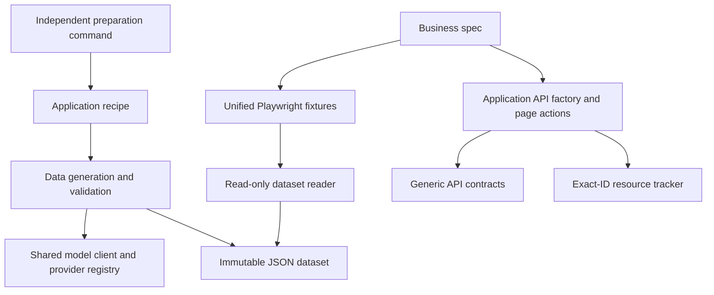

# Architecture

This repository is a Playwright + TypeScript **source template**. Consumers own their application adapters, requirements and business scenarios. Framework modules provide reusable execution, model access, input preparation, replay, resource lifecycle, coverage and reporting. The bundled localhost application demonstrates these contracts without external accounts.

Start with the [adoption guide](adoption-guide.md), use the [configuration reference](configuration.md) to connect services, and read the [data guide](test-data.md) for recipe and factory examples. Contributor checks are documented in [CONTRIBUTING](../CONTRIBUTING.md).

## Modules and dependency direction

| Module | Responsibility | Consumer extension |
| --- | --- | --- |
| `playwright.config.ts`, `scripts/run-playwright.cjs` | Native Playwright projects, execution settings, report ownership, example preparation | Application projects and verified environment settings |
| `tests/fixtures/` | Worker authentication extension, isolated test contexts, run ID, resource tracker, replay reader | Extend `workerStorageState` and typed domain fixtures |
| `tests/support/api/` | Assert HTTP status, business code and runtime response shape; dispose responses | Verified application routes, request/response contracts and authentication |
| `tests/support/llm/` | Shared configuration, provider registry, SDK protocol adapters, validated structured output | Register another provider in `model.config.ts` |
| `tests/support/data-generation/` | Recipe orchestration, seeded Faker, domain validation, bounded repair, immutable storage and replay | Application-owned schemas, prompts, builders, cases and rules |
| `tests/support/resource-*` | Per-attempt ledger, reverse-order cleanup, deadlines and unresolved-resource diagnostics | Exact-ID delete/restore callbacks and recovery tools |
| `tests/coverage/`, `tests/support/annotations.ts` | Stable `pageId/scenarioId` mapping and explicit support/exclude classification | Real requirement IDs and observable business assertions |
| `tests/reporters/`, `tests/support/scenario-analysis.ts` | Aggregate scenario outcomes and retain each retry attempt | Review reports and investigate evidence |
| `tests/support/regression-impact.ts` | Conservative selection from supplied changes | Requirement/API change producers |
| `examples/` | Disposable local application, example recipe, factory and support tests | Reference implementation; keep real business modules in the consuming repository |
| `.agents/skills/`, `scripts/init-agents.cjs` | Optional assistant workflow and official Playwright Agent initialization | Application context and reviewed plans |

Dependencies point from application modules to framework interfaces. Core code does not import application routes, credentials or business factories. The model layer depends on AI SDK and Zod; it has no recipe, Faker or Playwright dependency. The data-specific adapter supplies semantic-generation policy to that shared client. Dataset replay does not load `model.config.ts` or initialize a model provider.

## Configuration ownership

| Configuration | Owner and purpose |
| --- | --- |
| `.env.example` | Public catalogue of common settings, with empty model credentials |
| `.env` / CI environment | Local or environment-specific values; never committed |
| `model.config.ts` | Typed nonsecret model defaults and provider registrations |
| `playwright.config.ts` | Runner and project configuration |
| Application fixtures/contracts | Account scopes, verified routes, runtime schemas and business data factories |
| Application recipes | Semantic fields, deterministic builders, named rules and controlled negative cases |
| CLI arguments | One preparation operation's selected recipe, cases, budgets and output directory |

Model connection fields are `MODEL_NAME`, `API_BASE_URL`, `API_KEY`. Optional `MODEL_PROVIDER`, `MODEL_PROTOCOL`, `MODEL_OUTPUT_MODE` describe adapter capabilities. They are shared model settings, independent of any feature. `BASE_URL` refers to the application; `DATASET_ID` selects an already prepared batch. The CLI's `--mode offline|llm` selects preparation behavior, not a model vendor.

For model settings, nonempty process environment values override typed defaults. Model preparation and `model:check` load `.env` without overriding existing process variables. Programmatic model APIs have no dotenv side effect. Protocol, endpoint and output defaults are resolved by the selected adapter; incomplete or unsupported configuration fails before a request. The full field catalogue and examples live in [configuration.md](configuration.md).

## Model extension contract

`ModelProviderRegistry` maps provider IDs to a factory, default protocol, API prefix, credential requirement and permitted output modes. `createModelClient` resolves this configuration and produces a `ModelClient`. `generateObject` takes a schema, prompt, output limit and cancellation signal; it validates the final value locally in every mode. SDKs are imported lazily when their provider is selected.

Built-ins cover OpenAI Responses, Chat Completions and legacy Completions; OpenAI-compatible Chat Completions; Anthropic Messages; and Google Generate Content. `schema`, `json`, and `text` are explicit output strategies. Protocol-specific modes are listed by `npm run model:check -- --list`. Custom factories return an explicit AI SDK language-model instance (v2/v3/v4); additional SDKs or a private protocol implementation can be registered without changing recipes, fixtures or the runner.

Model names pass through without a framework whitelist. This lets a compatible service expose new model IDs without framework updates. A configured provider's capabilities describe request strategies, not a guarantee that every deployed model accepts them. Select the service's actual protocol and output mode and validate a small preparation batch. Embedding, image and audio models are outside the structured text-generation contract.

Provider separation follows the [AI SDK provider/model design](https://github.com/vercel/ai/blob/main/content/docs/02-foundations/02-providers-and-models.mdx). The [OpenAI structured-output guide](https://developers.openai.com/api/docs/guides/structured-outputs) distinguishes schema-constrained output from JSON mode; this framework keeps those choices explicit and validates both locally.

## Preparation and replay lifecycle

1. A trusted application recipe defines the input and semantic schemas, prompt version, deterministic builder, business rules and cases.
2. Independent preparation uses either seeded Faker semantics or the selected model. Models generate semantic fields; code controls numeric bounds, enum values, calculations and date relationships.
3. Schema and named rules validate a positive base. A negative case then applies a code-defined mutation and must violate exactly its declared rule IDs.
4. The engine permits at most three validation attempts and enforces request, batch and output limits. SDK transport retries are disabled. Authentication and transport errors fail directly; model failure never changes the mode to offline.
5. The store publishes a content-addressed JSON batch atomically. Its manifest records source, protocol/output mode when provided, recipe/schema/prompt fingerprints, versions, seed, fixed reference date, usage and limits. No endpoint, key, custom headers or raw provider error is stored.
6. A consumer reviews and provisions the batch. `testData.load` checks integrity, compatibility, case membership, schemas and rules before returning data and attaching the manifest to the report. Missing or incompatible batches remain failures.
7. A business factory creates dependencies and resources through real application APIs, immediately tracks returned IDs, and returns typed objects to the test. Assertions check observable business outcomes against reviewed requirements.

The stored output is the reproduction boundary for model data; a seed alone cannot reproduce a model response. Recipe code changes require a version bump because a fingerprint cannot fully characterize function behavior. Content hashes detect alteration or corruption and do not authenticate provenance. The [data guide](test-data.md) documents storage limits, rule design and CI batch provisioning.

Bundled example preparation is offline and runs in a subprocess before Playwright starts. Application regression requires provisioned data. Static framework checks reject direct model SDK imports and resolved recipe/model-generation calls in formal specs; the replay fixture exposes no generation method. These checks are development gates, not a security sandbox for arbitrary application code.

## Authentication and resource lifecycle

Worker-scoped authentication is supplied by an application extension of `workerStorageState`. Each test receives a new browser context. The default is one worker; increasing it requires `E2E_ISOLATED_WORKERS=true` and application-owned independent identities/data scopes. The flag does not create isolation.

`resources.track({ kind, id }, cleanup)` persists every newly created resource in an attempt-specific ledger. Teardown runs callbacks in reverse registration order, including after a failed test body. Callbacks delete or restore exact IDs and verify the result. Defaults are 5 seconds per resource, 20 seconds per cleanup operation and a 30-second fixture timeout. Results are persisted individually; damaged records, callback errors and timeouts remain unresolved and fail the test. Valid ledger records are still processed when another record is damaged.

A callback receives an `AbortSignal`. A deadline bounds framework waiting but cannot stop custom work that ignores cancellation. After a hard process termination, application recovery tools must consume the ledger and verify exact-ID cleanup. No generic bulk deletion is provided.

## Coverage, reporting and failure semantics

Product scenarios use stable coverage IDs. Support tests state their purpose explicitly. Every test bound to a scenario must pass for its outcome to be `passed`; mixed execution is `partial`, and retry recovery is `flaky`. Reports retain attempts, cleanup results and available browser evidence. A support example's success does not establish product coverage.

Execution, report preparation and Allure generation acquire the same exclusive checkout lock. Normal exit releases it; concurrent runs fail before clearing report directories. Use separate checkouts for concurrent runs. After a hard kill, verify the recorded owner PID has exited before removing a stale lock. Report archives do not delete frozen datasets or unresolved resource ledgers.

Public model diagnostics use `CONFIG`, `VALIDATION`, `PROVIDER` and `TIMEOUT` with controlled messages. Data storage/replay adds `STORAGE` and `REPLAY`. SDK causes, response bodies and authentication headers are not exposed by the framework model adapter. Consumer-defined adapters are trusted code and must preserve this contract.

## Verification and maintenance

- `quality:ci`: strict type checks, unit tests, syntax/type-aware framework rules and discovered scenario mapping.
- Model contract tests: real SDKs against mocked HTTP for built-in protocols, output modes, validation, cancellation, redaction and custom registration; no live model account is required.
- `test:adoption`: temporary no-Git consumer checkout, scaffolded recipes, custom provider configuration, replay, new-spec discovery, reports and publication-gate behavior.
- `test:lifecycle`: deliberately failing tests verify teardown, deadlines, unresolved resources and damaged-ledger handling.
- `npm test`: bundled browser/API examples and enabled application projects.
- `release:check`: static quality plus heuristic public-content scanning; reviewers still inspect the changed files.

The CI workflow configures Linux/Node 22 and Windows/Node 24. Local execution and CI results are separate evidence. Cloud-model availability, account permissions and application-specific behavior require target-environment validation.

Keep model configuration and extension documentation synchronized with registry changes. Add protocol contract tests for new adapters, lifecycle tests for cleanup changes, and consumer checks for new public entry points. Preserve immutable replay compatibility or explicitly version and document a migration. Contribution setup and review expectations follow the practical approach in [Playwright's contributor guide](https://github.com/microsoft/playwright/blob/main/CONTRIBUTING.md); this template's exact gates are in [CONTRIBUTING](../CONTRIBUTING.md).
